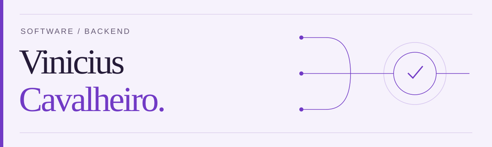

### Software developer · Backend

I build APIs, integrations and automation. Computer Science student with **two paid freelance projects**, open to internships and junior roles in Brazil.

**[Portfolio EN/PT ↗](https://vinioccode.github.io/portfolio/) · [LinkedIn ↗](https://www.linkedin.com/in/viniciusoccavalheiro/)**

### Professional work

- **[MLBot](https://vinioccode.github.io/mlbot-case-study/)** — Independently built a dashboard for creating, publishing, editing and auditing marketplace listings. **500+ listings processed**, with validation and human review. Public, sanitized case study.
- **Infrastructure & desktop automation** — Built a Python application for DigitalOcean instance management, IP/DNS validation, SSH configuration and email workflows. Distributed for Windows with PyInstaller. Confidential client project.

### Selected projects

- **[Note Taking C](https://github.com/ViniOcCode/note-taking-c)** — Markdown notes from the terminal. C · POSIX · CS50 final project.
- **[Diet Calc](https://github.com/ViniOcCode/diet-calc)** — Educational nutrition web app. Python · Flask · automated tests. [Live demo ↗](https://diet-calc.onrender.com/)
- **[Controle-Prod](https://github.com/ViniOcCode/Controle-de-Producao-1.0)** — Desktop production records and indicators. C# · WinForms · SQLite.

**Core tools:** Python · REST APIs · SQL · Flask · FastAPI · PostgreSQL · Git · Docker

Em português

Desenvolvedor de software e estudante de Ciência da Computação. Construo APIs, integrações e automações, com **dois projetos freelance pagos**. Busco estágio ou posição júnior no Brasil.

- **[MLBot](https://vinioccode.github.io/mlbot-case-study/)** — Arquitetura e implementação de um dashboard para criar, publicar, editar e auditar anúncios. Mais de **500 anúncios processados**. Case público sanitizado.
- **Automação de infraestrutura e desktop** — Aplicação Python para DigitalOcean, validação de IP/DNS, configuração via SSH e fluxos de e-mail. Distribuída para Windows com PyInstaller. Projeto de cliente confidencial.

[Conheça meu portfólio](https://vinioccode.github.io/portfolio/) · [Vamos conversar no LinkedIn](https://www.linkedin.com/in/viniciusoccavalheiro/)

